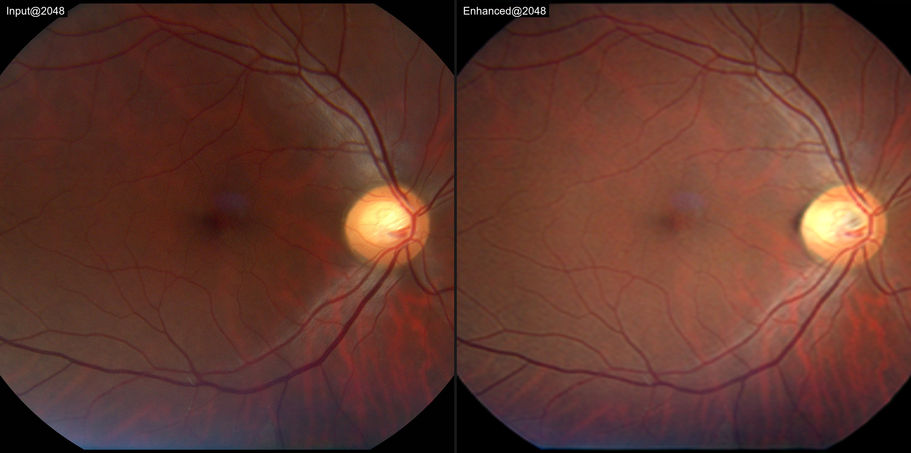
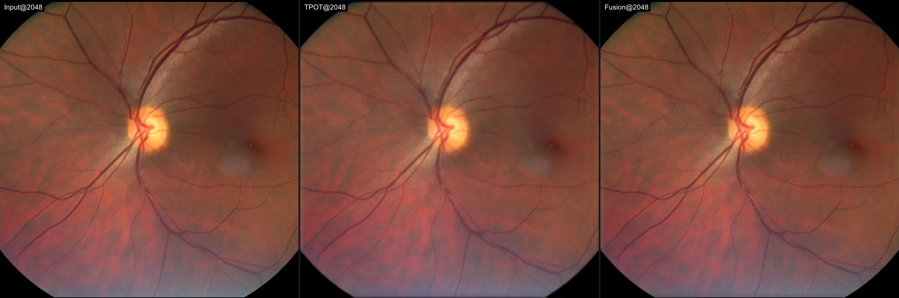
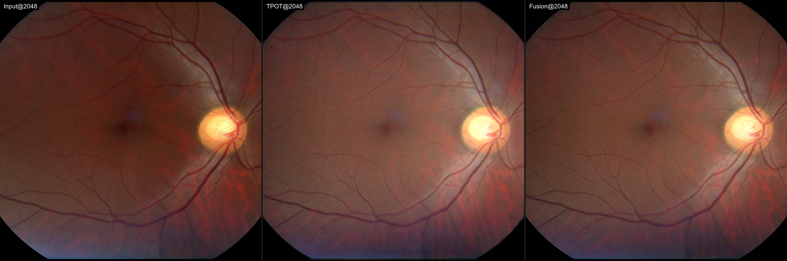

# TPOT-SR Fundus Image Enhancement 

Inference package for color fundus photograph (CFP) quality enhancement with super-resolution (2048x2048), built on TPOT.

| Mode | Command | Output |
|------|---------|--------|
| **Enhance** | `python enhance.py -i <input> -o <output>` | 256 enhancement, resized back to original dimensions |
| **Enhance + SuperResolution** | `python enhance.py -i <input> -o <output> --sr` | 2048×2048 fused image (native detail + TPOT enhancement style) |

---

## Quick Start

### 1. Environment

- Python 3.9+
- NVIDIA GPU + CUDA recommended (use `--device cpu` if no GPU)

```bash
pip install -r requirements.txt
```

If PyTorch is already installed:

```bash
pip install Pillow tqdm
```

### 2. Single image

```bash
# Enhance (default: resize back to original size)
python enhance.py --input samples/ML26_001898_001.jpg --output output

# Enhance + Super-Resolution (2048x2048)
python enhance.py --input samples/ML26_001898_001.jpg --output output_sr --sr
```

### 3. Batch folder

```bash
python enhance.py --input path/to/images --output path/to/enhanced
python enhance.py --input path/to/images --output path/to/fusion --sr
```

### 4. CPU-only

```bash
python enhance.py --input samples --output output --device cpu
```

---

## Demo Results

Pre-generated outputs live under `demo/`. Comparison images are rendered at **full 2048 px per panel** (no downscaling).

### Enhance mode (Input@2048 | Enhanced@2048)

| Sample | Notes |
|--------|-------|
|  | MobileLab low-quality fundus |
|  | MobileLab 2026 high-resolution |

### SuperResolution (Fusion) mode (Input@2048 | TPOT@2048 | Fusion@2048)

With `--sr`, the pipeline center-crops a square region, then fuses native detail with TPOT enhancement at 2048:

| Sample | Notes |
|--------|-------|
|  | Low-quality input: fusion keeps vessel detail while improving appearance |
|  | High-quality input: subtle refinement while preserving detail |

- `demo/input/` — 32 source images (MobileLab, MobileLab_2026, UK_CFP)
- `demo/enhance/` — enhancement outputs
- `demo/fusion/` — fusion outputs
- `demo/compare/` — side-by-side comparisons (64 images total)

Regenerate demos:

```bash
python collect_demo_inputs.py    # refresh inputs from E:/Data/Retina
python make_demo.py              # regenerate outputs and comparisons
```

---

## Command-Line Reference

```
python enhance.py --help
```

| Flag | Description | Default |
|------|-------------|---------|
| `--input`, `-i` | Input image or folder | required |
| `--output`, `-o` | Output folder | required |
| `--sr` | Enable 2048 fusion | off |
| `--checkpoint`, `-c` | TPOT base weights | `weights/best_SSIM.pth` |
| `--sr_checkpoint` | Fusion head weights | `weights/fusion_head_best.pth` |
| `--device` | `cuda` or `cpu` | auto-detect |
| `--no_restore_size` | Enhance mode: keep 256 output | resize back by default |
| `--restore_size` | Fusion mode: resize 2048 result to original size | keep 2048 by default |
| `--sr_size` | Fusion working resolution | `2048` |

More examples: [`cmd.txt`](cmd.txt).

---

## How It Works

**Enhance mode**

1. Resize input to 256×256
2. Run TPOT enhancement
3. Bicubic resize back to original dimensions

**Fusion mode (`--sr`)**

1. Center-crop input to a square
2. Branch A: crop → resize to 2048 → native detail `x_hr`
3. Branch B: crop → resize to 256 → TPOT enhance → upsample to 2048 → `e_hr`
4. Fusion head: `y = e_hr + residual(x_hr, e_hr)` — combines enhancement style with original structure

---

## Performance (reference)

RTX 4090, 100 MobileLab images with fusion (including disk write):

| Metric | Value |
|--------|-------|
| Average latency | ~75 ms/image |
| Throughput | ~3.4 images/s |
| Peak GPU memory | ~2.3 GB |

Actual speed depends on GPU, disk I/O, and whether `--sr` is enabled.

---

## Python API (optional)

256 enhancement only (no fusion):

```python
from tpot_api import enhance_folder

enhance_folder(
    checkpoint_path="weights/best_SSIM.pth",
    input_dir="samples",
    output_dir="output",
)
```

For fusion, use `enhance.py` or import `run()` from `enhance.py`.

---

## FAQ

**Q: Barely any visible change after enhancement?**  
A: Some images (e.g. pre-processed HQ fundus) are already high quality. Test on raw low-quality clinical images.

**Q: Why is `--sr` output square?**  
A: The fusion pipeline center-crops to a square and outputs 2048×2048. Add `--restore_size` to resize back to the original image dimensions.

**Q: Large weight files fail to download from Git?**  
A: Weights must ship with the package. If using Git LFS: `git lfs install && git lfs pull`.

**Q: Can I use a different TPOT checkpoint?**  
A: Yes. `--checkpoint` accepts `.pth` files with `model` or `state_dict` wrappers; the generator weights are extracted automatically.

---

## Version

- TPOT base: `best_SSIM.pth`
- Fusion head: SR_v2 `fusion_head_best.pth` (50 epochs)
- Package path: `BETA/`

For support, contact the team that provided this release.


## To-to list

- Add support to UK_Biobank and other datasets soon
- Add Domain-Adaptation support soon
